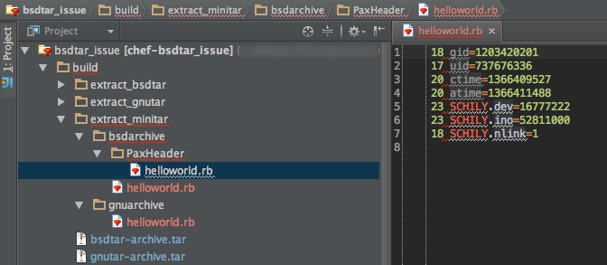

# bsdtar/gnutar/minitar - PaxHeader Problem

This proof-of-concept illustrates the difference between the bsd/gnu versions of tar, with regards to extended attributes and the potential problems caused during extraction.

## Overview

If an archive is created with the BSD version of tar (the default on Mac OS systems 10.6+), and any file contains extended attributes, additional files may be created by the extraction program if it doesn't understand those attributes. Case in point Ruby's Minitar.

- One such source of extended attributes are high user/group ids if the workstation is part of a networked domain.

**For example:**

	# What we archive:
	.
	└── helloworld.rb
	
	# What gets extracted (using a library like minitar):
	.
	├── PaxHeader
	│   └── helloworld.rb
	└── helloworld.rb
	
The contents of "PaxHeader/helloworld.rb" would appear similar to:

	18 gid=1203420201
	17 uid=737676336
	20 ctime=1366159262
	20 atime=1366393163
	23 SCHILY.dev=16777222
	23 SCHILY.ino=52395860
	18 SCHILY.nlink=1
	
**Screenshot**

### Here lies the problem

The "PaxHeader/helloworld.rb" file is not a valid Ruby file. In similar fashion any filetype may have a matching PaxHeader counterpart that claims (by filename suffix) to be source-code, but is in fact not. 

**Compilation errors can result if source files are loaded with glob patterns.**

### References

* [FreeBSD discussion on the PaxHeader behavior](http://lists.freebsd.org/pipermail/freebsd-current/2004-August/034946.html)

## Goal of this proof

The problem posed by the PaxHeader files being a given, this proof provides a testing suite which should confirm the following compatibility results (as to when PaxHeaders are generated).

**PASS = No PaxHeaders**

Archiver / Extractor | BSD Tar | GNU Tar | Minitar
--- | --- | --- | ---
BSD Tar (Archive) | PASS | PASS | **FAIL**
GNU Tar (Archive) | PASS | PASS | PASS

### Running the tests

	bundle install
	rake test
  
**Expected results**

	# Running tests:

	..F...
	
	Finished tests in 0.050244s, 119.4172 tests/s, 119.4172 assertions/s.
	
	  1) Failure:
	bsd tar archive::when extracted with minittar#test_0001_will not produce extra files [bsdtar_issue/test/minitest/test_bsdarchive.rb:20]:
	--- expected
	+++ actual
	@@ -1 +1,2 @@
	-"helloworld.rb"
	+"PaxHeader
	+helloworld.rb"
	
	
	6 tests, 6 assertions, 1 failures, 0 errors, 0 skips

## Likely conclusion

GNU Tar, which is provided as "/usr/bin/gnutar" can be used on the OS X platform with positive gain.
